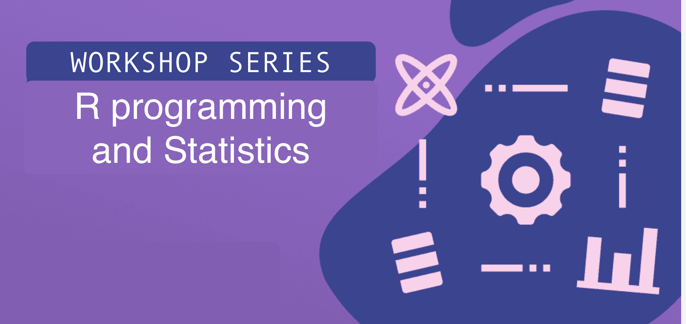

::: workshop-hero
{fig-alt="R + Statistics Workshop banner"}
:::

A **four-part workshop series** that teaches programming in R and statistics using
longitudinal study data. We start from the very beginning — no prior programming
experience assumed — and build toward running and interpreting your own analyses
on ABCD-style data.

Sessions are **live on Zoom, noon–2pm PT**. All registered participants receive the
Zoom link by email.

## Schedule

| Module | Date | Topic | Assumes |
|:--|:--|:--|:--|
| [**M0**](content/module0.qmd) | self-paced | Get your computer set up | Nothing |
| [**M1**](content/module1.qmd) | Thu **Sep 10, 2026** | Foundations of R programming | Never used R |
| [**M2**](content/module2.qmd) | Thu **Sep 24, 2026** | Data exploration, visualization & descriptive statistics | Module 1 |
| [**M3**](content/module3.qmd) | Thu **Oct 29, 2026** | Inferential statistics | Module 2 |
| [**M4**](content/module4.qmd) | Thu **Nov 12, 2026** | Applied projects | **Module 3 required** |

: {.schedule tbl-colwidths="[8,25,52,20]"}

## Start here

::: {.grid}

::: {.g-col-12 .g-col-md-6}
::: module-card
### Module 0 · Setup
[self-paced]{.module-when}

Install R and RStudio, or use Posit Cloud if your laptop is locked down.
Set up a project folder, install the packages we use, and run a short check
to confirm everything works.

[Start Module 0 →](content/module0.qmd)
:::
:::

::: {.g-col-12 .g-col-md-6}
::: module-card
### Module 1 · Foundations of R
[Sep 10, 2026]{.module-when}

Reading data, the shape of R code, the pipe, the core data-wrangling verbs,
handling missing values, and your first plots — all on a synthetic
ABCD-style dataset.

[Start Module 1 →](content/module1.qmd)
:::
:::

:::

## How the series fits together

You are welcome to attend **any module you like** — they are designed to stand on
their own where possible. That said, they do build on each other, and the one hard
rule is that **Module 3 is a prerequisite for Module 4**, since Module 4 is a
hands-on project session that assumes you can already choose and run a statistical
test.

If you have never opened R before, do [Module 0](content/module0.qmd) first. It is
short, self-paced, and it is the difference between spending the first half hour of
Module 1 fighting an installer or actually writing code.

## Certificates

After the series, we award a certificate backed by the **ABCD Professional
Development Workgroup** and **ABCD-ReproNim** indicating which modules you
completed. These are a useful addition to a CV and strengthen applications for
graduate school or roles that expect demonstrated statistical programming skill.

## What we teach with

We use **tidyverse** style R throughout — the `|>` pipe, and packages like
`dplyr`, `ggplot2` and `readr` — because it is the most readable way in for
newcomers and the style most modern R code you will meet is written in. We
introduce just enough base R notation along the way for you to read code you
find elsewhere.

All examples run on **synthetic datasets** shaped like an ABCD longitudinal
release: one row per participant per visit, with realistic missing data. They
contain no real participant data.

There are two, because a first hour in R should be spent learning R rather than
decoding variable names:

- **Module 1** uses a small CSV with three visits and plain English column names.
- **Modules 2, 3 and 4** use a fuller dataset — 500 participants across five annual
  visits, with real ABCD variable names, coded factor levels and structured missing
  data. The [dataset reference page](content/data.qmd) explains what is in it.

[Module 1 dataset](data/abcd-synthetic.csv){.btn .btn-outline-primary .btn-sm}
[Modules 2–4 dataset](content/data.qmd#get-the-files){.btn .btn-outline-primary .btn-sm}

## Questions?

Contact **Andrew Moore** ([ajm9311@ou.edu](mailto:ajm9311@ou.edu)) or
**Billu Das** ([biplabendu.das@gmail.com](mailto:biplabendu.das@gmail.com)).
